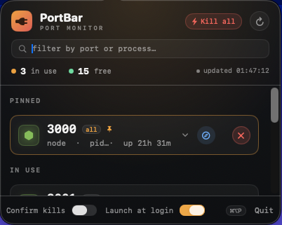
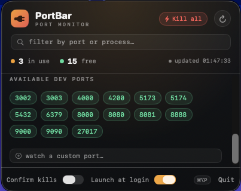

# PortBar

A native macOS menu bar app that shows which dev ports are **in use** vs **free**, and frees any port with a single click.

Built for the "wait, what's already on 3000?" problem when you're juggling several local apps at once.

  

<p align="center">
  
  
</p>

## What it does

- Lives in your menu bar as a 🔌 with a live count of dev ports in use.
- Click it (or hit **⌘⌥P** from anywhere) to open a dark "terminal-glass" panel.

### The list
- **Pinned** — ports you always care about, floated to the top (busy or free).
- **Process-type icons** — each port leads with a color-coded glyph for its process (node, Python, Docker, Postgres, Redis, Mongo, nginx, Java, Go, …) so you read the list at a glance.
- **In use** — each occupied dev port as a card. Click it to expand the **full info package**:
  - full **command line**, **owner**, **bind scope** (local / all), **uptime**, and **working directory**.
  - per-port actions: **copy** port / PID / URL / cwd, **reveal cwd in Finder**, **open a Terminal there**, **open in browser**, **pin**.
- **Other listeners** — everything else listening (system services etc.), collapsed by default.
- **Available dev ports** — free ports as pills; click to copy, right-click to pin or remove.

### Actions
- **One click on ✕** frees a port (graceful `SIGTERM`, then `SIGKILL` if needed).
- **⚡ Kill all** — free every dev port in use at once (the panic button).
- **Search** — filter by port number or process name.
- **Add custom port** — watch any port beyond the common dev list (persisted).
- **Confirm kills** and **Launch at login** toggles in the footer.

It refreshes every **3s while open** and every **30s while closed** (just to keep the menu-bar count fresh), and surfaces failures honestly: if `lsof` breaks you get a banner (not a fake "all clear"), and if a kill is denied (a process you don't own) it tells you instead of pretending it worked. When the panel is closed the view tree is released entirely, so it sits at **~0% CPU / ~16 MB**.

### Global hotkey
**⌘⌥P** toggles the panel from any app (system-wide, no extra permissions). Chosen to avoid VS Code's ⌘⇧P. Change it in `Sources/PortBar/HotKey.swift`.

## Common dev ports watched

`3000–3003, 4000, 4200, 5000, 5173/5174, 5432, 6379, 8000, 8080/8081, 8888, 9000, 9090, 27017`

Edit `commonDevPorts` in `Sources/PortBar/PortScanner.swift` to tweak the list.

## Build & install

```bash
# Build the .app bundle into ./build
./build-app.sh

# …or build and copy it straight to /Applications
./build-app.sh --install
```

Then launch it from Spotlight (or `open build/PortBar.app`). Flip on **Launch at login** in the footer and it's always there.

### Run from source (dev)

```bash
swift run            # debug build, runs in the menu bar
swift build -c release
```

## Sharing / distribution (code signing & notarization)

`build-app.sh` picks a signing identity automatically:

1. **Developer ID Application** cert → signs with **hardened runtime + timestamp** (distributable & notarizable). **Best for sharing.**
2. **Apple Development** cert → signs, but the app **only runs on the Mac that built it**.
3. No cert → **ad-hoc** signature (local only).

To share PortBar with someone else without Gatekeeper blocking it, you need a Developer ID cert (requires the **Apple Developer Program**, $99/yr) and a one-time **notarization**:

```bash
# 1. Build & sign with your Developer ID (auto-detected, or pass explicitly):
./build-app.sh --sign "Developer ID Application: Your Name (TEAMID)"

# 2. Zip and notarize (store credentials once with `xcrun notarytool store-credentials`):
ditto -c -k --keepParent build/PortBar.app build/PortBar.zip
xcrun notarytool submit build/PortBar.zip --keychain-profile "AC_PASSWORD" --wait

# 3. Staple the ticket so it validates offline:
xcrun stapler staple build/PortBar.app
```

The resulting `PortBar.app` (or a zip of it) runs cleanly on any modern Mac.

## How it works

- `PortScanner` shells out to `lsof` for listening sockets, then enriches each PID with `ps` (full args + uptime) and a second `lsof -d cwd` (working directory), batched. Every external command has a 5s timeout so a hung tool (stale network mount) can't freeze the app.
- `PortStore` is the `@MainActor` observable that scans on a timer, performs kills (reporting real success/failure), and persists pinned + custom ports in `UserDefaults`.
- The UI is SwiftUI hosted in an AppKit `NSStatusItem` + `NSPopover` (so a global Carbon hotkey can toggle it) — `PanelView` + `PortCardView`, styled via `Theme`.
- The panel's view tree is **built on open and torn down on close**, so nothing renders while hidden (idle CPU ≈ 0). Scan cadence adapts: 3s open / 30s closed.
- No Dock icon (`LSUIElement`).

### Source layout

| File | Role |
|------|------|
| `PortScanner.swift` | `lsof`/`ps` scanning, enrichment, killing |
| `PortStore.swift` | `@MainActor` state, timers, persistence, actions |
| `AppDelegate.swift` | status item, popover lifecycle, hotkey wiring |
| `PanelView.swift` | the panel: header, search, sections, footer |
| `PortCardView.swift` | one expandable port card |
| `ProcessIcon.swift` | process → SF Symbol + color mapping |
| `Theme.swift` | colors, fonts, the glow dot |
| `HotKey.swift` | global Carbon hotkey (⌘⌥P) |
| `FlowLayout.swift` | wrapping layout for the free-port pills |

## Notes

- Killing a process owned by another user (or root) requires elevated permissions; PortBar will tell you when it can't.
- It only sends signals to PIDs you can already signal — it does not escalate privileges.

## Contributing

Issues and PRs welcome. Tweak the watched-port list in `PortScanner.commonDevPorts`, add process mappings in `ProcessIcon`, or restyle via `Theme`. Build with `swift build` and run with `swift run`.

## License

[MIT](LICENSE) © 2026 Abhinav
